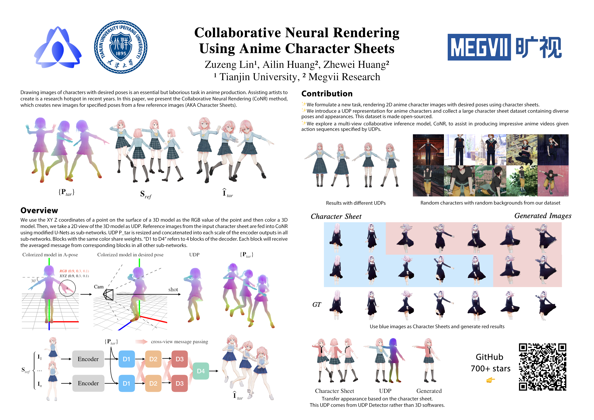

[English](https://github.com/megvii-research/CoNR/blob/main/README.md) | [中文](https://github.com/megvii-research/CoNR/blob/main/README_chinese.md)
# Collaborative Neural Rendering using Anime Character Sheets 


## [Homepage](https://conr.ml) | Colab [English](https://colab.research.google.com/github/megvii-research/CoNR/blob/main/notebooks/conr.ipynb)/[中文](https://colab.research.google.com/github/megvii-research/CoNR/blob/main/notebooks/conr_chinese.ipynb) | [arXiv](https://arxiv.org/abs/2207.05378)



## Introduction

This project is the official implement of [Collaborative Neural Rendering using Anime Character Sheets](https://arxiv.org/abs/2207.05378), which aims to genarate vivid dancing videos from hand-drawn anime character sheets(ACS). Watch more demos in our [HomePage](https://conr.ml).

Contributors: [@transpchan](https://github.com/transpchan/), [@P2Oileen](https://github.com/P2Oileen), [@hzwer](https://github.com/hzwer)

## Usage

#### Prerequisites

* NVIDIA GPU + CUDA + CUDNN
* Python 3.6

#### Installation

* Clone this repository

```bash
git clone https://github.com/megvii-research/CoNR
```

* Dependencies

To install all the dependencies, please run the following commands.

```bash
cd CoNR
pip install -r requirements.txt
```

* Download Weights
Download weights from Google Drive. Alternatively, you can download from [Baidu Netdisk](https://pan.baidu.com/s/1U11iIk-DiJodgCveSzB6ig?pwd=RDxc) (password:RDxc).

```
mkdir weights && cd weights
gdown https://drive.google.com/uc?id=1M1LEpx70tJ72AIV2TQKr6NE_7mJ7tLYx
gdown https://drive.google.com/uc?id=1YvZy3NHkJ6gC3pq_j8agcbEJymHCwJy0
gdown https://drive.google.com/uc?id=1AOWZxBvTo9nUf2_9Y7Xe27ZFQuPrnx9i
gdown https://drive.google.com/uc?id=19jM1-GcqgGoE1bjmQycQw_vqD9C5e-Jm
```

#### Prepare Inputs
We provide two Ultra-Dense Pose sequences for two characters. You can generate more UDPs via 3D models and motions refers to [our paper](https://arxiv.org/abs/2207.05378).
[Baidu Netdisk](https://pan.baidu.com/s/1hWvz4iQXnVTaTSb6vu1NBg?pwd=RDxc) (password:RDxc) 

```
# for short hair girl
gdown https://drive.google.com/uc?id=11HMSaEkN__QiAZSnCuaM6GI143xo62KO
unzip short_hair.zip
mv short_hair/ poses/

# for double ponytail girl
gdown https://drive.google.com/uc?id=1WNnGVuU0ZLyEn04HzRKzITXqib1wwM4Q
unzip double_ponytail.zip
mv double_ponytail/ poses/
```

We provide sample inputs of anime character sheets. You can also draw more by yourself.
Character sheets need to be cut out from the background and in png format.
[Baidu Netdisk](https://pan.baidu.com/s/1shpP90GOMeHke7MuT0-Txw?pwd=RDxc) (password:RDxc) 

```
# for short hair girl
gdown https://drive.google.com/uc?id=1r-3hUlENSWj81ve2IUPkRKNB81o9WrwT
unzip short_hair_images.zip
mv short_hair_images/ character_sheet/

# for double ponytail girl
gdown https://drive.google.com/uc?id=1XMrJf9Lk_dWgXyTJhbEK2LZIXL9G3MWc
unzip double_ponytail_images.zip
mv double_ponytail_images/ character_sheet/
```

#### RUN!
* with web UI (powered by [Streamlit](https://streamlit.io/))

```
streamlit run streamlit.py --server_port=8501
```
then open your browser and visit `localhost:8501`, follow the instructions to genarate video.

* via terminal

```
mkdir {dir_to_save_result}

python -m torch.distributed.launch \
--nproc_per_node=1 train.py --mode=test \
--world_size=1 --dataloaders=2 \
--test_input_poses_images={dir_to_poses} \
--test_input_person_images={dir_to_character_sheet} \
--test_output_dir={dir_to_save_result} \
--test_checkpoint_dir={dir_to_weights}

ffmpeg -r 30 -y -i {dir_to_save_result}/%d.png -r 30 -c:v libx264 output.mp4 -r 30
```

## Citation
```bibtex
@article{lin2022conr,
  title={Collaborative Neural Rendering using Anime Character Sheets},
  author={Lin, Zuzeng and Huang, Ailin and Huang, Zhewei and Hu, Chen and Zhou, Shuchang},
  journal={arXiv preprint arXiv:2207.05378},
  year={2022}
}
```

